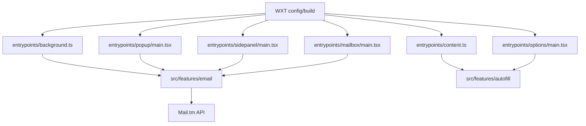

<p align="center">
  
</p>

<h1 align="center">SudoFill</h1>

<p align="center">
  Temporary inboxes, fast signup autofill, and verification links in one browser extension.
</p>

<p align="center">
  <a href="https://github.com/bdtran2002/SudoFill/actions/workflows/ci.yml"></a>
  <a href="https://github.com/bdtran2002/SudoFill/actions/workflows/actionlint.yml"></a>
  <a href="https://github.com/bdtran2002/SudoFill/actions/workflows/release.yml"></a>
  <a href="./LICENSE"></a>
</p>

SudoFill is a browser extension for short-lived signups. It gives you a disposable mailbox, helps fill common registration forms, and keeps verification emails nearby so you do not have to use your personal inbox.

## Highlights

- Disposable Mail.tm inboxes with create, refresh, discard, and copy actions
- Built-in mailbox UI for reading messages, rendering useful email content, and opening detected verification links
- Autofill for common signup fields like name, birth date, address, and email
- Domain-aware verification popup for matching pages, with link and code shortcuts
- Shared autofill settings page for tuning profile defaults and local history behavior
- Full-page mailbox view for reviewing incoming mail more comfortably
- Local-first settings: autofill preferences stay in browser storage

## Surfaces

| Browser | Surface           | Notes                                  |
| ------- | ----------------- | -------------------------------------- |
| Firefox | Toolbar popup     | Fast compact flow from the browser bar |
| Chrome  | Side panel        | Wider mailbox and autofill workflow    |
| Both    | Full-page mailbox | Better for reading and managing email  |
| Both    | Options page      | Adjust autofill defaults and behavior  |

## Core workflow

1. Open SudoFill.
2. Create a temporary mailbox.
3. Open the signup page you want to fill.
4. Run autofill from the popup or side panel on that site tab.
5. Wait for the verification email.
6. Use the mailbox's recommended verification action, or the in-page popup when you are already on the matching site.

## What SudoFill can fill

SudoFill works best on standard account-creation forms and similar onboarding flows.

It commonly fills:

- email
- first name, last name, or full name
- date of birth
- sex or gender when a form asks for it
- business name in some signup layouts
- street, city, state, country, and postal code

It also tries to avoid bad fills by skipping:

- hidden fields
- read-only fields
- fields that already contain user-entered values
- pages that do not look like a normal signup flow

## Autofill settings

The Options page controls the generated profile SudoFill uses during autofill.

You can tune:

- generated address on or off
- preferred US state
- age range
- whether generated profiles lean male or female when a form asks
- whether the verification assist popup appears on matching pages
- whether local autofill usage history is saved

These settings are saved in browser storage. If you enable usage history, the saved entries stay local to the browser on that device and are not encrypted.

## Privacy and behavior

- SudoFill talks to `https://api.mail.tm/*` to create temporary inboxes and fetch messages.
- Temporary mailbox session state is stored in browser session storage.
- Autofill preferences are stored in synced browser storage.
- Optional autofill usage history is stored in local browser storage and is not encrypted.
- Autofill only runs when you explicitly trigger it from the extension UI.
- The extension does not download and execute remote code.
- Verification links and codes are surfaced as recommendations from parsed email content.

## Limitations

- Best for short-lived signups, not accounts you plan to keep long term
- Sites that require phone or SMS verification are not supported
- Very custom or multi-step forms may still need manual fixes
- Autofill only targets normal `https://` pages
- Verification popup matching is heuristic-based, so emails sent from unrelated delivery domains may not surface in-page

## Developer setup

SudoFill uses **Bun**, **WXT**, **React**, and **TypeScript**.

### Install

```bash
bun install
```

### Run locally

Firefox:

```bash
bun run dev:firefox
```

Chrome:

```bash
bun run dev:chrome
```

Quick local verification:

```bash
bun run dev:test
```

That runs typecheck, unit tests, and production builds for Firefox and Chrome.

### Build bundles

```bash
bun run build:firefox
bun run build:chrome
```

### Package bundles

```bash
bun run zip:firefox
bun run zip:chrome
```

### Quality checks

```bash
bun run lint
bun run format:check
bun run typecheck
bun run test
bun run release:check
bun run firefox-addon:check
```

## Firefox packaging and review

The committed `firefox-addon/` directory is a checked-in Firefox review snapshot. Refresh it with:

```bash
bun run firefox-addon:sync
```

For self-distributed Firefox releases:

1. Set a stable `gecko.id` in `firefox.config.ts`.
2. Optionally set `gecko.update_url` if you host Firefox update metadata yourself.
3. Run the verification commands.
4. Build the Firefox package with `bun run zip:firefox`.
5. Submit the Firefox package to AMO as an **unlisted** add-on for signing.
6. Host the signed `.xpi` yourself after AMO returns it.

Use `SOURCE_CODE_REVIEW.md` for reviewer-facing notes and the exact Firefox review flow.

## Release workflow

The repo ships with automated release plumbing:

- **CI** runs on pushes and pull requests to `main`
- **Actionlint** validates workflow files
- **release-please** opens and updates release PRs from `main`
- **Release** validates the tagged commit, rebuilds browser bundles, packages artifacts, and uploads release assets

release-please keeps these files in sync:

- `package.json`
- `CHANGELOG.md`
- `.release-please-manifest.json`
- `firefox-addon/manifest.json`

## Repository map



- `entrypoints/background.ts` — mailbox lifecycle, polling, badge updates, and runtime routing
- `entrypoints/content.ts` — autofill entrypoint for supported pages
- `entrypoints/mailbox/main.tsx` — full-page mailbox UI
- `entrypoints/options/main.tsx` — autofill settings UI
- `entrypoints/popup/main.tsx` — Firefox popup UI
- `entrypoints/sidepanel/main.tsx` — Chrome side-panel UI
- `src/features/email/` — mailbox state, Mail.tm integration, command routing, and email UI
- `src/features/autofill/` — profile generation, matching heuristics, settings, and content-script fill logic
- `wxt.config.ts` — manifest generation and browser-specific config
- `firefox.config.ts` — Firefox ID and optional update URL

## License

GPLv3. See `LICENSE`.
