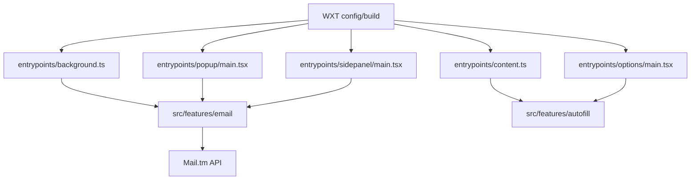

<p align="center">
  
</p>

<h1 align="center">⚡ SudoFill</h1>

<p align="center">
  Create a temporary inbox, fill common sign-up forms, and handle verification emails without using your personal inbox.
</p>

SudoFill is a browser extension for temporary sign-ups. It gives you a disposable email address, helps fill common registration fields, and keeps verification emails in one place so you do not have to use your real inbox.

- **Firefox:** toolbar popup
- **Chrome:** side panel
- **Your autofill profile stays in the browser**

## What it does

- Create, refresh, and discard temporary inboxes
- Copy the active email address with one click
- Read incoming verification emails inside the extension
- Open detected verification links in a new tab
- Autofill common sign-up fields like name, email, birth date, and address
- Adjust autofill defaults from the Options page

## How to use it

1. Open SudoFill in your browser.
2. Create a temporary mailbox.
3. Open the sign-up page you want to fill.
4. Click **Autofill** in the extension.
5. Wait for the verification email to arrive.
6. Open the message and follow the verification link.

## What it can fill

SudoFill works best on standard account-creation forms.

It can usually fill fields such as:

- email
- first name, last name, or full name
- date of birth
- sex or gender when a form asks for it
- business name in some sign-up layouts
- street, city, state, country, and postal code

It also tries to avoid bad fills by skipping:

- hidden fields
- read-only fields
- fields that already contain something you entered
- pages that do not look like a normal sign-up flow

## Customize autofill

The Options page lets you adjust the profile SudoFill uses during autofill.

You can adjust:

- generated address on or off
- preferred US state
- age range
- whether generated profiles lean male or female when a form asks

These settings are saved in browser storage.

## Browser support

| Browser | Experience    | Notes                                       |
| ------- | ------------- | ------------------------------------------- |
| Firefox | Toolbar popup | Best for quick access from the browser bar. |
| Chrome  | Side panel    | Same core flow in a wider side panel.       |

## Privacy

- SudoFill only talks to `https://api.mail.tm/*` to create temporary inboxes and fetch messages.
- Temporary mailbox session state is kept in browser session storage.
- Autofill preferences are kept in synced browser storage.
- Autofill only runs when you trigger it from the extension UI.
- The extension does not download and run remote code.
- Verification links open in a new tab only when you choose them.

## Limitations

- SudoFill is best for short-lived sign-ups, not accounts you want to keep forever.
- Sites that require phone or SMS verification are not supported.
- Very custom or multi-step forms may still need manual fixes.
- Autofill only targets normal `https://` pages.
- HTML-heavy emails may not fully render in the UI, but detected verification links can still be opened directly.

## For developers

### Local setup

SudoFill uses **Bun**, **WXT**, **React**, and **TypeScript**.

Install dependencies:

```bash
bun install
```

Run in development:

Firefox:

```bash
bun run dev
```

Chrome:

```bash
bun run dev:chrome
```

Quick local check:

```bash
bun run dev:test
```

This runs a fast sanity check without Docker: typecheck, unit tests, and Firefox + Chrome production builds.

Build production bundles:

```bash
bun run build:firefox
bun run build:chrome
```

Package browser bundles:

```bash
bun run zip:firefox
bun run zip:chrome
```

Quality checks:

```bash
bun run lint
bun run format:check
bun run typecheck
bun run test
bun run release:check
bun run firefox-addon:check
```

### Firefox packaging and review

The committed `firefox-addon/` directory is a checked-in Firefox review snapshot. Refresh it with:

```bash
bun run firefox-addon:sync
```

For self-distributed Firefox releases:

1. Set a stable `gecko.id` in `firefox.config.ts`.
2. Optionally set `gecko.update_url` if you host Firefox update metadata yourself.
3. Run the verification commands.
4. Build the Firefox package with `bun run zip:firefox`.
5. Submit the Firefox package to AMO as an **unlisted** add-on for signing.
6. Host the signed `.xpi` yourself after AMO returns it.

Use `SOURCE_CODE_REVIEW.md` for reviewer-facing notes and the exact Firefox review flow.

### Release workflow

SudoFill ships with an automated release pipeline:

- **CI** runs on pushes and pull requests to `main`
- **Actionlint** validates workflow files
- **Release-please** opens and updates release PRs from `main`
- **Release** validates the tagged commit, rebuilds both browser bundles, packages artifacts, and uploads release assets

Release-please keeps these files in sync for versioned releases:

- `package.json`
- `CHANGELOG.md`
- `.release-please-manifest.json`
- `firefox-addon/manifest.json`

### Repository map



- `entrypoints/background.ts` — mailbox lifecycle, polling, badge updates, and message routing
- `entrypoints/content.ts` — autofill entrypoint for supported pages
- `entrypoints/options/main.tsx` — autofill settings UI
- `entrypoints/popup/main.tsx` — Firefox popup UI
- `entrypoints/sidepanel/main.tsx` — Chrome side-panel UI
- `src/features/email/` — mailbox state, Mail.tm integration, email parsing, and command routing
- `src/features/autofill/` — profile generation, matching heuristics, settings, and content-script fill logic
- `wxt.config.ts` — manifest generation and browser-specific config
- `firefox.config.ts` — Firefox ID and optional update URL

## License

GPLv3. See `LICENSE` for the full text.
